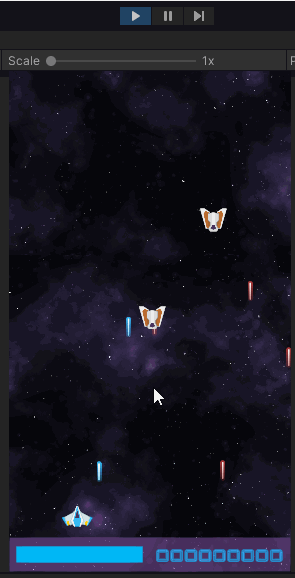

# Laser-Defender-game_Unity

Link play: <a href="https://halac123b.github.io/Laser-Defender-game_Unity/">Github Page</a>

A simple endless space shooter game where I learned: 

<ul>
  <li>Run time Instantiate Objects following defined Path</li>
  <li>Scrolling background effect</li>
  <li>More details about Singleton pattern</li>
</ul>

